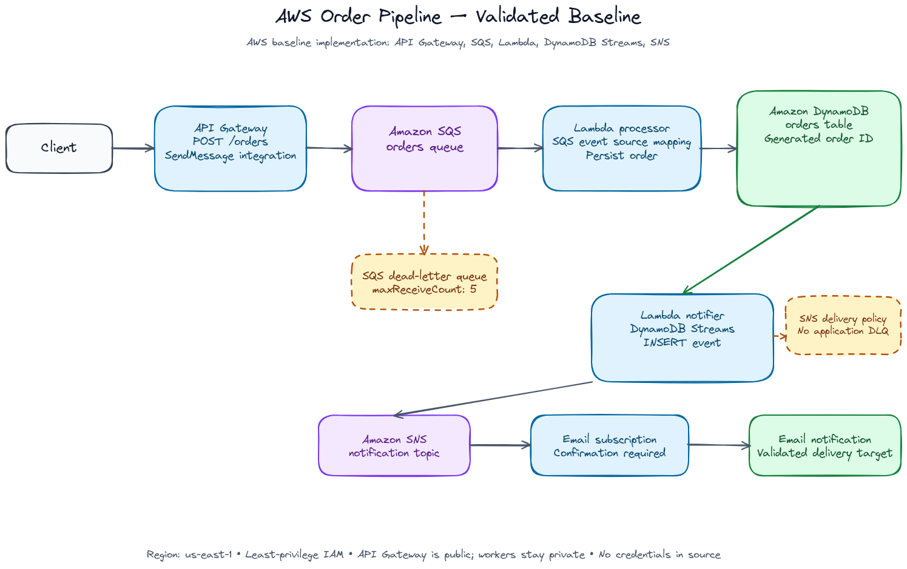
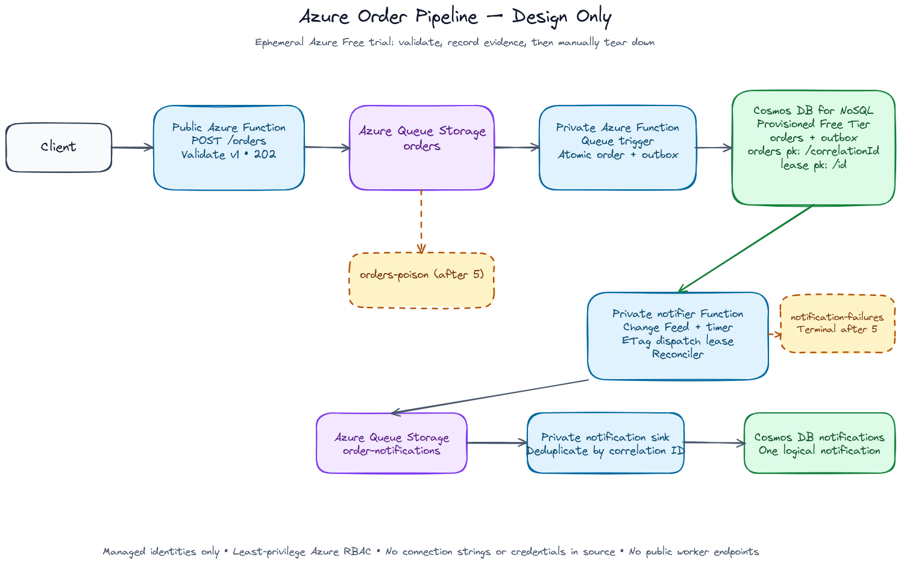
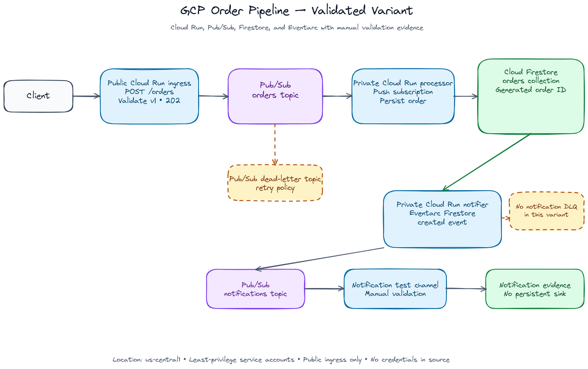

# serverless-order-pipeline-multicloud

Starting from a classic AWS Architecting Solutions exercise, this repo
evolves a working AWS pipeline into an auditable multicloud comparison.
AWS is the functional baseline; GCP and Azure will preserve the same
architectural responsibilities while using their native services.

## Architecture



The deployed and validated GCP variant is documented in
[its architecture diagram](providers/gcp/docs/diagrams/architecture.png) and
[validation record](providers/gcp/docs/validation.md).

The approved Azure design is shown below. It is an ephemeral Azure Free-trial
implementation that was deployed and validated with a sanitized smoke test.



The Azure infrastructure incident diagnosis, permanent Terraform safeguards,
and sanitized validation outcome are recorded in
[`providers/azure/docs/infrastructure-incident-resolution.md`](providers/azure/docs/infrastructure-incident-resolution.md).

```
Client --POST /orders--> API Gateway --SendMessage--> SQS (POC-Queue)
  --SQS trigger--> Lambda 1 --PutItem--> DynamoDB (orders)
  --Streams INSERT--> Lambda 2 --Publish--> SNS (POC-Topic) --> Email
```

- **API Gateway → SQS**: a native AWS Service integration (`POST /orders`)
  writes straight to SQS — no Lambda sits in the request path just to
  forward a message.
- **SQS → Lambda 1 → DynamoDB**: the queue decouples ingestion from
  processing and absorbs bursts; Lambda 1 persists each order with a
  generated `orderID`.
- **DynamoDB Streams → Lambda 2 → SNS → Email**: every insert into
  `orders` triggers Lambda 2 asynchronously via DynamoDB Streams, which
  publishes a notification to SNS's single email subscription — no
  polling anywhere in the pipeline.

The AWS baseline runs in `us-east-1` as a single development environment.
Its scope and technical constraints are recorded in the active
[AI Together Framework V3 constitution](.framework/constitution/).

## GCP variant

The validated GCP implementation preserves the same responsibilities with
native services:

```text
Client --POST /--> Cloud Run ingress --publish--> Pub/Sub orders
  --push--> Cloud Run processor --write--> Firestore orders
  --Firestore created event--> Eventarc --> Cloud Run notifier
  --publish--> Pub/Sub notifications
```

The processor subscription has a dead-letter topic and inspection
subscription. Only ingress is public; processor and notifier are private.
The deployment and end-to-end evidence are documented in
[`providers/gcp/docs/validation.md`](providers/gcp/docs/validation.md).



## Shared functional contract

The provider-neutral HTTP contract, processing responsibilities, and portable
test payloads are defined in
[`docs/contracts/order-pipeline-v1.md`](docs/contracts/order-pipeline-v1.md).
It is the target for future provider implementations; the AWS baseline's
current response and validation behavior are documented separately.

## Key architecture decisions

The preserved AWS decisions and baseline behavior are documented in
[`providers/aws/docs/`](providers/aws/docs/). Headlines:

- **Least privilege everywhere, with one documented exception.** Every
  IAM policy is scoped to the exact ARN of the resource it needs — no
  `Resource: "*"`, except for the account-level API Gateway CloudWatch
  role, which AWS structurally requires to have broader CloudWatch Logs
  permissions
  ([decision record](providers/aws/docs/legacy-sdd-decisions.md)).
- **Decoupling with a safety net.** SQS sits between the API and the
  processing Lambda, and `POC-Queue` has a dead-letter queue so a
  poison-pill message gets dead-lettered after 5 failed attempts instead of
  retrying forever — a deliberate improvement over the original exercise
  ([decision record](providers/aws/docs/legacy-sdd-decisions.md)).
  Batch failures are reported per-message
  (`ReportBatchItemFailures`), so one bad order never blocks the rest of
  a batch.
  DynamoDB Streams (`NEW_IMAGE`) does the same decoupling job on the
  notification side — Lambda 2 reacts to data changes, it isn't wired
  directly to Lambda 1.
- **No implicit resource creation.** Both Lambdas' CloudWatch Log Groups
  and API Gateway's access-log group are declared explicitly, with
  bounded retention and a `depends_on` that forces Terraform to create
  them before the resource that would otherwise create them implicitly
  ([decision record](providers/aws/docs/legacy-sdd-decisions.md)).
- **Errors are explicit, not silent.** `api-ingestion`'s `200` response
  maps SQS's raw XML to JSON; because that response is now explicitly
  mapped, `400`/`500` are mapped too — an unmapped SQS error would
  otherwise surface as a misleading `200`
  ([decision record](providers/aws/docs/legacy-sdd-decisions.md)).

## Repo structure

```
providers/aws/envs/dev/ # Terraform stack for the AWS dev environment
providers/aws/src/lambdas/ # Python code (lambda_1: SQS -> DynamoDB, lambda_2: Streams -> SNS)
providers/aws/docs/diagrams/ # AWS architecture diagram (SVG + Excalidraw source + PNG export)
providers/aws/docs/reference/ # AWS reference material (original exercise baseline)
.framework/constitution/ # Active mission, technical constraints, roadmap, and framework diagrams
modules/             # Reusable Terraform modules (only where justified — none needed yet)
docs/diagrams/       # Editable multicloud workflow diagram
.github/workflows/   # CI (fmt + validate, no credentials, no apply)
```

## How to deploy

Deployment is manual, by design — the coding agent never runs
`terraform apply` (see [Development workflow](#development-workflow)
below). To stand this up in your own AWS account:

```bash
cd providers/aws/envs/dev
terraform init

# notification_email has no default on purpose — supply your own
cp terraform.tfvars.example terraform.tfvars
# edit terraform.tfvars and set notification_email

terraform plan
terraform apply
```

After `apply`, AWS emails the address in `notification_email` a
subscription-confirmation link — the SNS subscription stays
`PendingConfirmation` until you click it. Test the pipeline with:

```bash
curl -X POST "$(terraform output -raw api_invoke_url)/orders" \
  -d '{"item": "widget", "quantity": 3}'
```

You should get a JSON response with a `messageId`, an item appear in the
`orders` DynamoDB table shortly after, and an email notification once the
subscription is confirmed.

### Tearing down

This is a portfolio PoC, not a running service — destroy it when you're
done to avoid incurring cost:

```bash
cd providers/aws/envs/dev
terraform destroy
```

## Development workflow

This project uses **AI Together Framework V3** with explicit human
architectural ownership. The agent prepares and implements approved work;
the architect owns decisions, reviews, and every cloud-changing command.

[Open the editable multicloud workflow diagram](docs/diagrams/multicloud-ait-workflow.excalidraw).

The active project context is maintained in the
[constitution](.framework/constitution/): mission, technical stack,
roadmap, and framework diagrams. It defines an AWS baseline first,
followed by an approved design and implementation path for each additional
provider. The GCP design and implementation are complete; Azure remains the
next provider-specific design and implementation path. GCP is deployed
manually in a development project; identifiers,
credentials, and billing contacts remain local-only.

For each substantial change, the workflow is:

1. **Frame the work** — establish scope, affected provider, constraints,
   and the intended validation evidence.
2. **Review and decide** — record decisions in the active Framework
   artifacts and obtain the architect's approval where required.
3. **Implement and validate** — make provider-scoped changes, then run
   non-mutating checks such as `terraform fmt -check`, `terraform validate`,
   and code compilation.
4. **Close the loop** — capture durable decisions and update the roadmap
   before moving to the next provider or phase.

Agents never run `terraform apply` or `terraform destroy`. The architect
runs those commands manually when the approved design is ready and verifies
or tears down the deployed pipeline as appropriate.

## License

[MIT](LICENSE)
