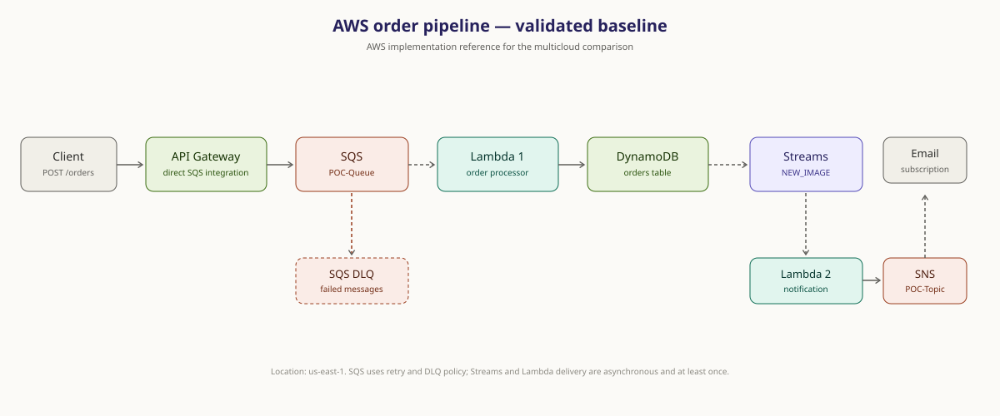

# AWS Provider

AWS is the functional baseline for the multicloud comparison. Its validated
pipeline uses API Gateway, SQS with a dead-letter queue, Lambda, DynamoDB with
Streams, SNS, and an email subscription.

The editable source and historical PNG export remain in
[`docs/diagrams/`](docs/diagrams/). Provider decisions and baseline behavior
are documented in [`docs/pipeline-baseline.md`](docs/pipeline-baseline.md).
